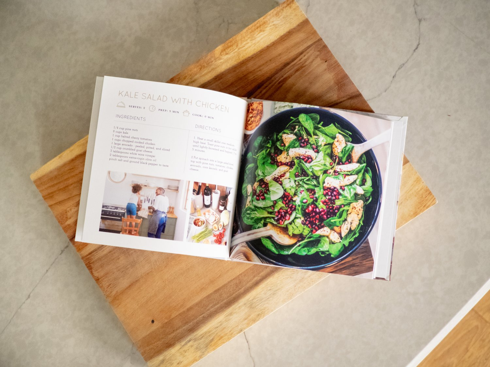
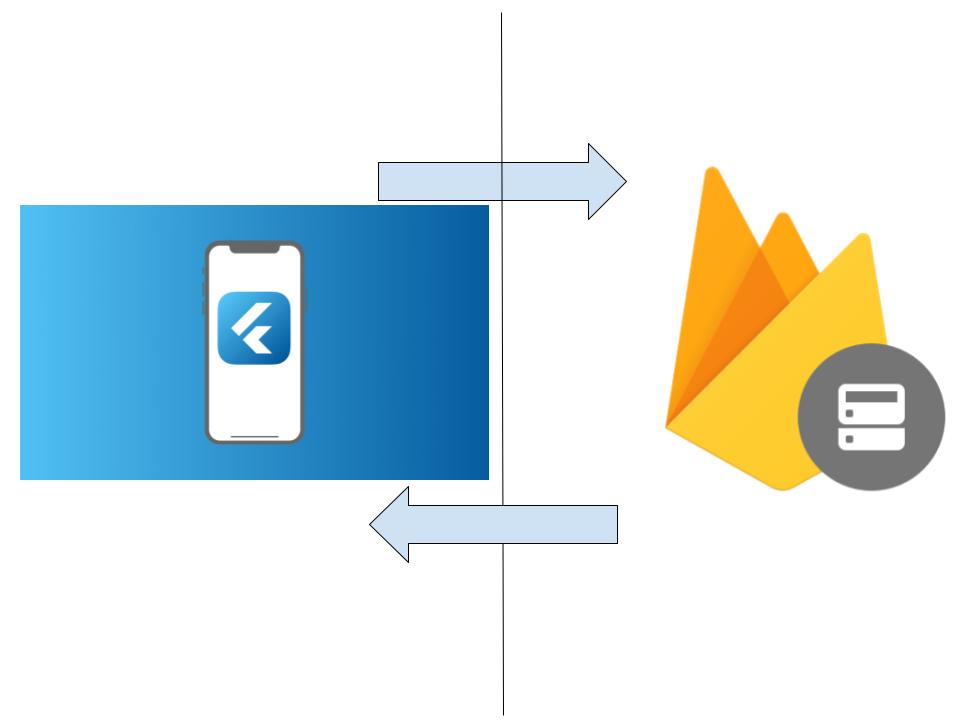

```
Software Engineering - CIS 350
```
<p align="center">
  
</p>

# **Recipe Finder**
## Created by: 
---
### Gabe Baksa
### Evan Gronewald 
### Caleb Kipp
---
___
## 1. Abstract
This abstract presents a mobile application designed to revolutionize cooking experiences by efficiently matching user-input ingredients to a vast recipe database. The app matches input to pair available ingredients with suitable recipes. The system prioritizes user convenience and engagement by offering personalized recipe recommendations based on the ingredients at hand. Through an intuitive and user-friendly interface, this mobile app streamlines the process of meal planning, reducing food waste, and enabling users to create diverse and delicious dishes effortlessly. The app's innovation lies in its ability to adapt to user preferences and available ingredients while presenting an accessible and enjoyable culinary exploration for users of all skill levels. This mobile application stands at the forefront of simplifying cooking experiences, promoting sustainable practices, and enhancing culinary creativity.
___
## 2. Introduction
In an era where culinary exploration and meal planning intersect with technology, our mobile application emerges as a groundbreaking solution to streamline the cooking process. The app represents an innovative and user-centric approach to simplify the often daunting task of deciding what to cook based on available ingredients. The inspiration behind this app stems from the common challenge many individuals face: standing in front of a pantry or refrigerator, uncertain of what to prepare with the ingredients on hand. With the vision to empower users and revolutionize their cooking experiences, our team set out to develop a mobile application that not only addresses this challenge but also encourages culinary creativity. This introduction marks the inception of a mobile app that is more than just a recipe database. It represents a system that understands available ingredients to offer tailored recipe suggestions. By prioritizing user convenience, this app seeks to transform cooking into an enjoyable and efficient endeavor for users of all culinary skill levels.
## 3. Architectural Design
Our App works with a client-server architecture. The client is given an interactive iOS-based user interface for sorting through ingredients they have and finding recipes that match those ingredients. The server-side processing will be held in Firebase. The client requests the server with their list of ingredients and the server will respond with a recipe that matches those ingredients.

<p align="center">
  
  <br>
  <br>
  Figure 1: Client Server Architecture of RecipeFinder App
</p>

### 3.1 Class Diagram
This section contains the class diagram for the recipe app, showing the boundary class "Recipe" that the user interacts with, the enity class "Database" that stores the recipe data, and the control class "Finder" that finds the recipe and another boundary class "UserIngredients that allows the user to edit the ingredients that they have.

<p align="center">
  
  <br>
  <br>
  Figure 2: Class Diagram for RecipeFinder App
</p>

### 3.2 Use Case Diagram


### 3.3 Sequence Diagram


### 3.4 Activity Diagram


## 4. User Guide / Implementation

## 5. Future Scope
## 6. Conclusion
## 7. Walkthrough

[Firebase Project Link](https://console.firebase.google.com/u/0/project/recipeapp-98710/overview?utm_source=welcome&utm_medium=email&utm_campaign=welcome_2021_CTA_A)

